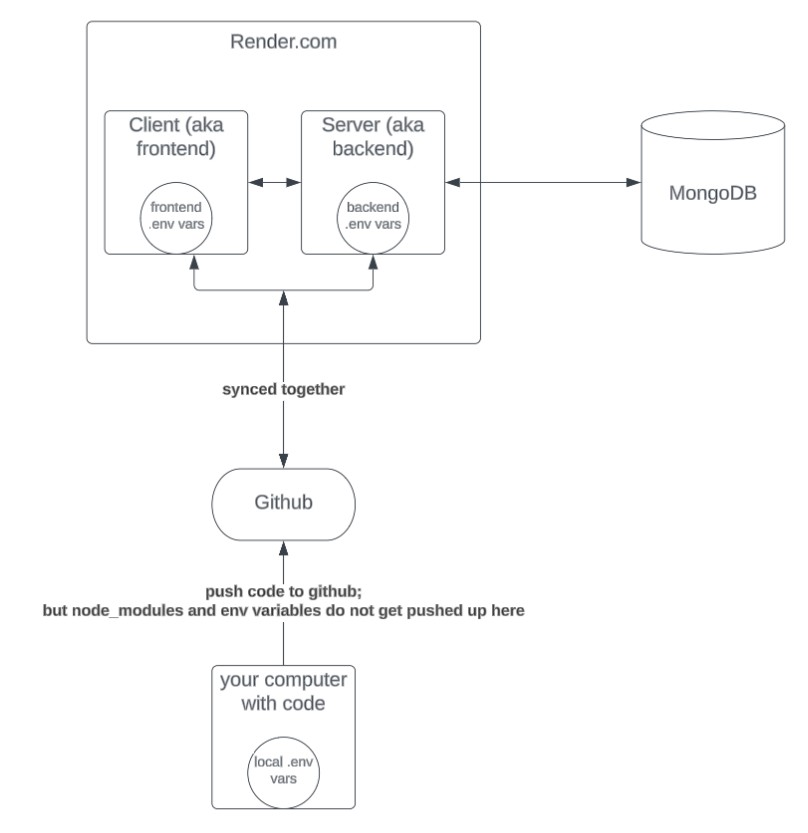
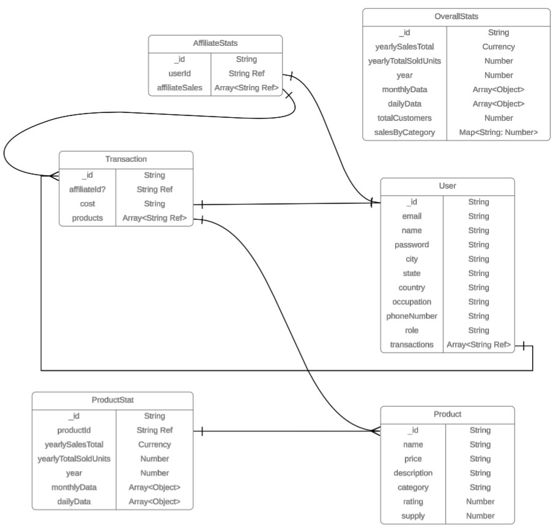

# **AdminView Fullstack Dashboard**  
**Name:** [Rusheel Chande]  
**Web App URL:** [https://admin-frontend-duoc.onrender.com/](https://admin-frontend-duoc.onrender.com/)

---

## **Project Overview**

The **AdminView Dashboard** is a full-stack **MERN (MongoDB, Express, React, Node.js)** application I designed to highlight both **front-end interactivity** and **back-end architecture**. Users can view/interact with **data tables**, **charts**, and **geographical maps** to analyze key metrics like **sales**, **products**, **customers**... 

The project emphasizes:

1. **Backend**: Written in **Node.js** using **Express.js** and **Mongoose** for stable, scalable APIs and data models.
2. **Frontend**: Built in **React**, featuring **Redux Toolkit Query (RTK Query)** for stateful data fetching and **Material-UI (MUI)** for interface.
3. **Real Deployment**: Both **frontend** and **backend** hosted on **Render.com**, connected to a remote **MongoDB** database.
4. **Detailed Analytics**: Visuals (charts, tables, maps) to show **data-driven insights** in real time.

---

## **Architecture**

Below is a high-level depiction of how the client, server, and database interact:

### **Client (Frontend)**
- **Built with React.js**.  
- Manages global state and API calls using **Redux Toolkit & RTK Query**.  
- Deployed on **Render.com**; environment variable `REACT_APP_BASE_URL` specify the backend URL.  
- Renders data from the server through dynamic components, charts, maps, and tables.

### **Server (Backend)**
- An **Express.js** application running on **Node.js**.  
- Endpoints:  
  - `/client/*` for products, transactions, and customers  
  - `/general/*` for user and dashboard stats  
  - `/management/*` for admin and performance data  
  - `/sales/*` for broader sales statistics  
- Also deployed to **Render.com**; environment variables `MONGO_URL` point to the MongoDB database.

### **MongoDB Database**
- Stores data for:  
  - Users and their roles (**user**, **admin**, **superadmin**)  
  - Products and their stats (daily, monthly, yearly)  
  - Transactions (purchase records)  
  - Aggregated stats (daily, monthly, yearly totals)  
- Hosted on **MongoDB Atlas**.

The frontend and backend kept in repository but deployed as **two separate services** on Render. This allows each service to be scaled, updated, and managed independently while retaining a single, consolidated codebase.

---

## **Data Model**

The data model is organized into these main Mongoose schemas:

### **User**
- **Fields**: `name`, `email`, `password`, `role`, `city`, `state`, `country`, `occupation`, `phoneNumber`, `transactions`...
- Stores primary user info (including roles like user or admin).
- Holds references to user transactions.

### **Product & ProductStat**
- **Product**: Defines `name`, `price`, `category`, `rating`, `supply`...
- **ProductStat**: Tracks daily/monthly/yearly sales data per product.
- Allows quick expansions or breakdowns of each product’s historical performance.

### **Transaction**
- Logs individual purchase events.
- Includes which user purchased, which products were bought, total cost, ...
- Provides direct data for transaction history and analytics.

### **OverallStat**
- Aggregates stats for the entire app in one place:
  - `totalCustomers`
  - `yearlySalesTotal`
  - `yearlyTotalSoldUnits`
  - `monthlyData` and `dailyData` arrays
  - `salesByCategory` map
- Simplifies retrieving high-level metrics for the dashboard overview.

### **AffiliateStat**
- Tracks affiliate or admin performance.
- Includes references to transactions they influenced.
- Supplies data for “Performance” pages that show how many sales a particular user (affiliate or otherwise) has generated.

**Impact**:  
These schemas allow dynamic visualizations including **Breakdown Charts** (by category), **Geography** (user distribution by country), and **Daily/Monthly** line charts. By normalizing key metrics into dedicated schemas, the dashboard can render (not too quickly) essential analytics with minimal queries.

## **Features**

### **Dashboard Overview**
- Landing page with quick stats: total customers, daily/monthly/yearly revenue...  
- Line charts show cumulative monthly revenue or units sold.  
- Pulls from **OverallStat**, **Transaction**, and **User** data.

### **Product Management**
- Lists products with expandable cards to reveal supply and additional sales data.  
- Integrates with **Product** and **ProductStat** for a deeper look at performance.

### **Customer and Admin Panels**
- **MUI DataGrid** pages for both customers and admins.  
- Supports sorting, pagination, searching, column hiding, and filtering.  
- Data comes from the **User** schema, filtered by role.

### **Transactions**
- Server-side pagination plus sorting and searching by cost or user ID.  
- Demonstrates an efficient method for large data sets, fetching only needed items with each page load.  
- Ideal for transaction logs referencing **Transaction** documents.

### **Geography View**
- Displays a choropleth map using `@nivo/geo` and a geoData file.  
- Colors countries by user counts (**User.country**).  
- Real-time user distribution insights.

### **Daily & Monthly Analytics**
- **Daily stats**: date picker range, using data from **OverallStat** or combined daily logs.  
- **Monthly stats**: year-long line chart to see monthly sales or units.  
- Integrates seamlessly with **Nivo** line charts for a smooth, interactive experience.

### **Breakdown Chart**
- Pie/Donut chart for sales by category (e.g., “Electronics”, “Furniture”...).  
- Pulls data from `salesByCategory` in **OverallStat**.  
- Helps instantly visualize revenue proportions per category.

### **Responsive Layout & Dark Theme**
- Collapsible sidebar that adjusts based on screen width.  
- Dark mode theming: easily extended to light mode if desired.  
- Styled with **Material-UI** (including color tokens, theming, and typography).

---

## **Technology Stack**

### **Frontend**
- **React.js** – Core library for building the user interface.  
- **Redux Toolkit & RTK Query** – Manages global state and provides data fetching/caching.  
- **Material-UI (MUI)** – Design framework for layout, theming, and styling.  
- **Nivo Charts** (`@nivo/line`, `@nivo/pie`, `@nivo/geo`, etc.) – Data visualizations.  
- **React Router** – Client-side navigation and route management.

### **Backend**
- **Node.js** – JavaScript runtime environment for the server.  
- **Express.js** – Web framework for routing and middleware.  
- **Mongoose** – ODM layer for defining and accessing MongoDB schemas.  
- **Helmet**, **CORS** – HTTP header security and cross-origin handling.  
- **Morgan**, **Body-Parser** – Logging and request body parsing utilities.  
- **Dotenv** – Manages environment variables (`MONGO_URL` and others) in development.

### **Deployment & Infrastructure**
- **Render.com** – Hosts client and server as separate services:
  - Automatic builds from GitHub commits.
  - Configurable environment variables for each service.
- **MongoDB Atlas** (or alternative remote DB) – Central store for:
  - `User`, `Product`, `Transaction`, `OverallStat`, `AffiliateStat`, etc.
  - Ensures cloud-based, scalable data storage.
